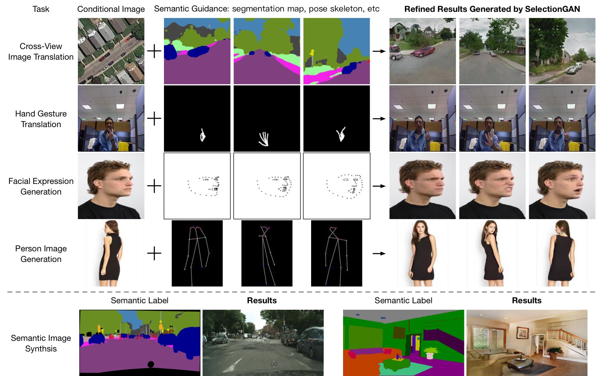

[](https://github.com/Ha0Tang/SelectionGAN/blob/master/LICENSE.md)


[](https://github.com/Ha0Tang/SelectionGAN/graphs/commit-activity)




# SelectionGAN for Guided Image-to-Image Translation
### [CVPR Paper](https://arxiv.org/abs/1904.06807) | [Extended Paper](https://arxiv.org/abs/2002.01048) | [Guided-I2I-Translation-Papers](https://github.com/Ha0Tang/Guided-I2I-Translation-Papers)

Code coming soon!

## Citation
If you use this code for your research, please cite our papers.
```
@article{tang2020multi,
  title={Multi-Channel Attention Selection GANs for Guided Image-to-Image Translation},
  author={Tang, Hao and Xu, Dan and Yan, Yan and Corso, Jason J and Torr, Philip HS and Sebe, Nicu},
  journal={arXiv preprint arXiv:2002.01048},
  year={2020}
}

@inproceedings{tang2019multichannel,
  title={Multi-Channel Attention Selection GAN with Cascaded Semantic Guidance for Cross-View Image Translation},
  author={Tang, Hao and Xu, Dan and Sebe, Nicu and Wang, Yanzhi and Corso, Jason J. and Yan, Yan},
  booktitle={Proceedings of the IEEE Conference on Computer Vision and Pattern Recognition (CVPR)},
  year={2019}
}
```

## [Related Projects](https://github.com/Ha0Tang/Guided-I2I-Translation-Papers)
### Cross-View Image Translation 
- [X-Seq & X-Fork (CVPR 2018, Torch)](https://github.com/kregmi/cross-view-image-synthesis)
- [Pix2pix (CVPR 2017, PyTorch)](https://github.com/junyanz/pytorch-CycleGAN-and-pix2pix)
- [CrossNet (CVPR 2017, Tensorflow)](https://github.com/viibridges/crossnet)

### Hand Gesture Translation 
- [GestureGAN (ACM MM 2018, PyTorch)](https://github.com/Ha0Tang/GestureGAN)

### Facial Expression Generation
- [C2GAN (ACM MM 2019, PyTorch)](https://github.com/Ha0Tang/C2GAN)
- [Talking Heads (ICCV 2019, PyTorch)](https://github.com/grey-eye/talking-heads)
- [GANimation (ECCV 2018, PyTorch)](https://github.com/albertpumarola/GANimation)
- [StarGAN (CVPR 2018, PyTorch)](https://github.com/yunjey/stargan)

### Person Image Generation
- [Pose Transfer (CVPR 2019, PyTorch)](https://github.com/tengteng95/Pose-Transfer)
- [DPIG (CVPR 2018, Tensorflow)](https://github.com/charliememory/Disentangled-Person-Image-Generation)
- [VUnet (CVPR 2018, Tensorflow)](https://github.com/CompVis/vunet)
- [PoseGAN (CVPR 2018, Tensorflow)](https://github.com/AliaksandrSiarohin/pose-gan)
- [PG2 (NIPS 2017, Tensorflow)](https://github.com/charliememory/Pose-Guided-Person-Image-Generation)

### Semantic Image Synthesis
- [GauGAN (CVPR 2019, PyTorch)](https://github.com/NVlabs/SPADE)
- [Pix2pixHD (CVPR 2018, PyTorch)](https://github.com/NVIDIA/pix2pixHD)
- [SIMS (CVPR 2018, Tensorflow)](https://github.com/xjqicuhk/SIMS)
- [CRN (ICCV 2017, Tensorflow)](https://github.com/johnathanlouie/crn)

## To Do List
- [x] SelectionGAN: CVPR version
- [x] SelectionGAN++: TPAMI submission
- [x] Pix2pix++: Takes RGB image and target semantic map as inputs: [code](./cross_view_v2)
- [x] X-ForK++: Takes RGB image and target semantic map as inputs: [code](./cross_view_v2)
- [x] X-Seq++: Takes RGB image and target semantic map as inputs: [code](./cross_view_v2)

## Others
- [How to write a great science paper](https://www.nature.com/articles/d41586-019-02918-5)

## Acknowledgments
This source code borrows heavily from [Pix2pix](https://github.com/junyanz/pytorch-CycleGAN-and-pix2pix).

## Contributions
If you have any questions/comments/bug reports, feel free to open a github issue or pull a request or e-mail to the author Hao Tang ([hao.tang@unitn.it](hao.tang@unitn.it)).


